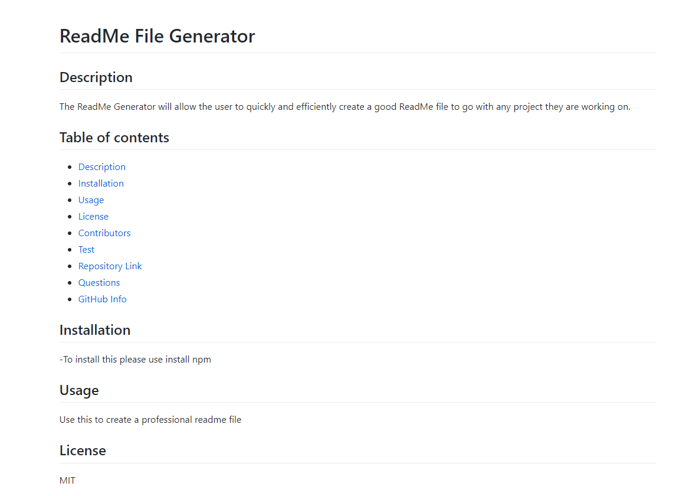
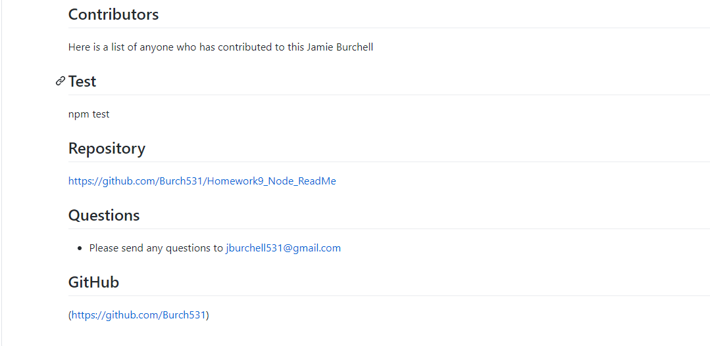

Homework_9_Node_ReadMe

The ReadMe Generator will allow the user to quickly and efficiently create a good ReadMe file to go with any project they are working on.  It will include the title, description, Installation, Usage, License, Contributors, Respository link and Github user link.

Link to github https://github.com/Burch531/Homework9_Node_ReadMe

Screenshot of a ReadMe file that is created

Video walkthrough of file being created
